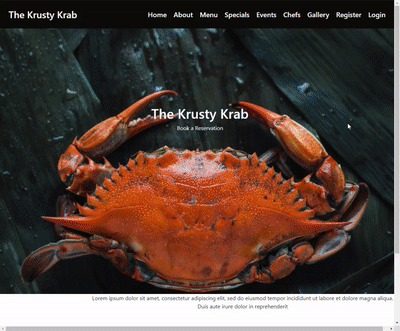

# SECRETRECIPE

A React Project built for Mod 2 covering basic authentication, React Frontend, Express JS Backend, and RESTful CRUD operations.

---

## Table of contents

- [Introduction](#introduction)
- [Competencies](#competencies)
- [Demo](#demo)
- [Technologies](#technologies)
- [Setup](#setup)
- [Features](#features)
- [Contact](#contact)

---

## Introduction

This project is centered around The Krusty Krab and protecting the Secret Recipe through basic authentication. Users can navigate an enticing menu, but must log in with a valid email and password to view the special ingredients that make the infamous Krusty Krab.

---

## Competencies

#JF 1.7

- Demonstrates creativity and tenacity in their approach to
solutions and the methods used to come to a solution for example,
sees the task through to the end by devising new solutions and
despite obstacles and problems along the way.

#JF 3.7

- Acts with integrity with respect to ethical, legal and regulatory
ensuring the protection of personal data, safety and security.

#JF 4.8

- Is able to interpret and implement a given design whilst remaining
compliant with security and maintainability requirements

---

## Demo



---

## Technologies

- React - version 17.0.2
- Node.js - version 14.15.4
- Express.js - version 4.17.1
- Express Basic Auth - version 1.2.0

---

## Setup

To run this project, install it locally using npm:

```
$ cd 1_Bootcamp/SecretRecipe/client/spongebob
$ npm install
$ npm start
```

And in a parallel terminal:

```
$ cd 1_Bootcamp/SecretRecipe/server
$ npm install
$ npm start
```

---

## Features

Users should be able to:

- sign in with the login form
- view menu
- add and remove products from the menu after authentication

Stretch Goals:

- Deploy the app on Heroku
- Add unit tests in Jest
- Add AuthO for 3rd party sign in

---

## Contact

- [Judith Liem](https://github.com/jjliem)
- [Johnny Tyson](https://github.com/Tyson3rd)
- [Stanley Enyinnaya](https://github.com/ifeanchi)
