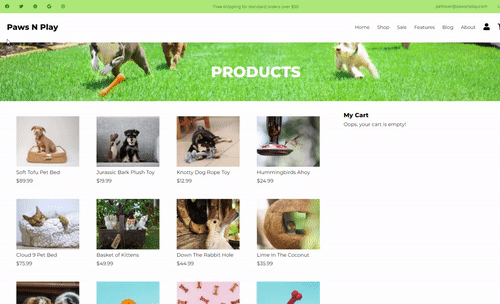

# PAWS-N-PLAY

A React Project built for learning React, how props are passed, and how state works.

---

## Table of contents

- [Introduction](#introduction)
- [Competencies](#competencies)
- [Demo](#demo)
- [Technologies](#technologies)
- [Setup](#setup)
- [Features](#features)
- [Contact](#contact)

---

## Introduction

Paws-N-Play is an online petstore which uses React to display products to the user. This is my first React project and focuses mainly on the modularity of React components and how props and state work to pass data across different components.

---

## Competencies

#JF 2.3

- Applies logical thinking. For example, uses clear and valid
reasoning when making decisions related to undertaking work
instructions

#JF 3.4

- Able to create simple software designs to effectively communicate
understanding of the program


#JF 4.3

- Understands and can link code to data sets

---

## Demo



---

## Technologies

- React - version 17.0.2

---

## Setup

To run this project, install it locally using npm:

```
$ cd 2_Personal_Projects/react-paws-n-play
$ npm install
$ npm start
```

---

## Features

Users should be able to:

- view product inventory
- add and remove products from a shopping cart

Stretch Goals:

- Deploy the app on Heroku
- Add unit tests in Jest
- Add email notifications when items are left in shopping cart
- Add out of stock alert when items go out of stock
- Add login functionality

---

## Contact

- [Judith Liem](https://github.com/jjliem)
